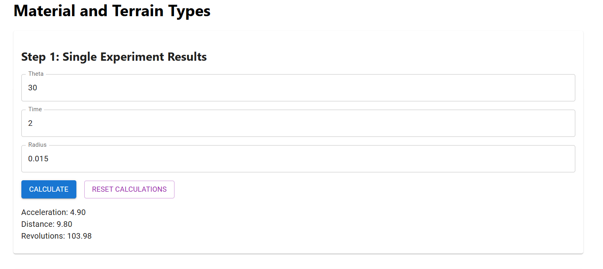
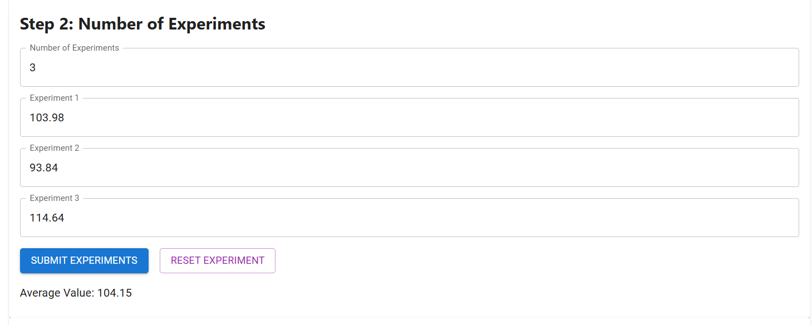
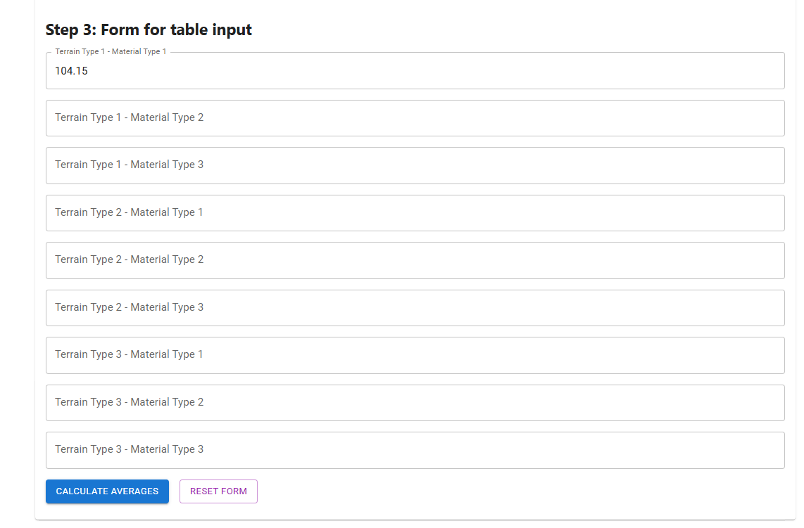
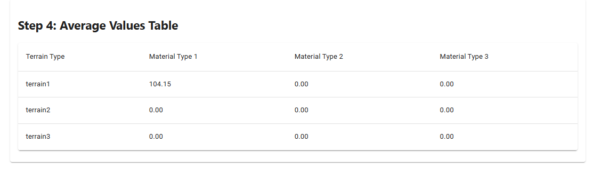
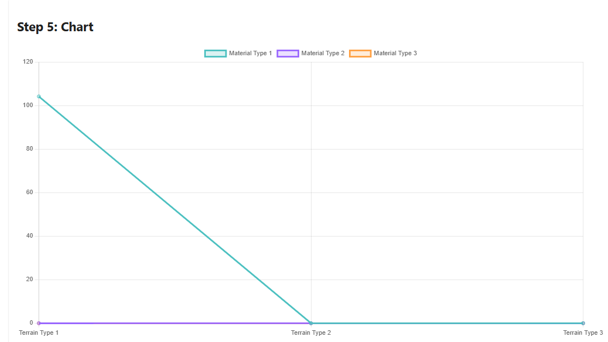

# Material Terrain App

## Description
This Project is a web application designed to provide users with an easy experimental setup to do a comparative analysis of different wheel material of rover on various terrains. The project leverages the power of React to create a dynamic and responsive user interface.

## Reason Behind the Project
The primary motivation for this project was to present it in the Space Science Exhibition held on 17 August 2024, in the Department of Physics, AMU.

## Team Members
- Mr. Afshan Alam   - [LinkedIn](https://www.linkedin.com/in/afshan-alam/)  
- Mr. Mujtaba Abbas - [LinkedIn](https://www.linkedin.com/in/mujtaba-abbas-8a1a44217/)
- Ms. Aasia Ali     - [LinkedIn](https://www.linkedin.com/in/aasia-ali-72a661243/)

## Features
- **Responsive Design**: Adapts to various screen sizes.
- **Component-Based Architecture**: Easy to maintain and extend.
- **State Management**: Efficient handling of application state using React hooks.
- **API Integration**: Fetches data from external APIs to display dynamic content.

## Setup and Installation

### Prerequisites
- Node.js (v20 or higher)
- npm or yarn

### Installation Steps
1. **Clone the repository:**
    ```bash
    git clone https://github.com/AfshanAlamEngg/material-terrain-app
    cd material-terrain-app
    ```

2. **Install dependencies:**
    ```bash
    npm install
    ```

3. **Start the development server:**
    ```bash
    npm start
    ```

4. **Open your browser and navigate to:**
    ```
    http://localhost:3000
    ```

## Usage Steps

1. Decide the material of wheel and terrain type for the experiemnt.

2. Enter the observation values in "Step 1: Single Experiment Results"
    

3. Then pick anyone parameter out of the three result. i.e. 
    - Acceleration
    - Distance
    - Revolutions

    Most preferrable is Revolutions.


4. Then enter your choosen result parament into the "Step 2: Number of Experiments" Form and repeat steps 2 and 3 as many times you prefer. After that click "submit experiment" button. This wil give you "Average Value".
    

5. Enter this "Average Value" into the "Step 3: Form for table input" under it respective material and terrain type.

    

6. Now you will see the value in the "Step 4: Average Values Table" as well as in the "Step 5: Chart".
    

    

## Conclusion
Using this experiment anyone can findout which wheel material performs better on which type of terrain. 

## Contributing
Contributions are welcome! Please fork the repository and create a pull request with your changes.

## License
This project is licensed under the MIT License. See the LICENSE file for more details.

## Acknowledgements
- React documentation
- Open-source libraries and tools used in this project

